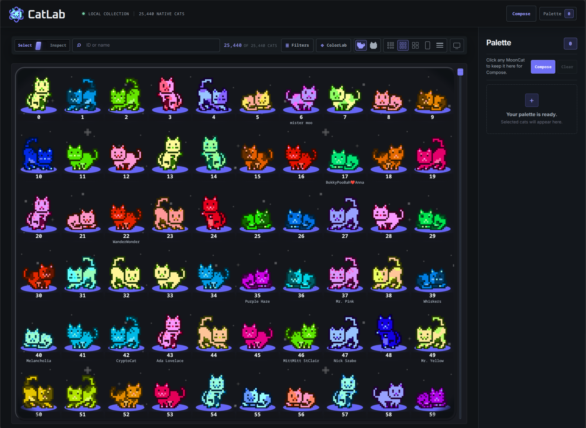

# CatLab



CatLab is a MoonCat collection browser and creative composition workspace. Find
MoonCats, gather them in a Palette, build a scene with them, and save the
result as a CatLab project or export it as an image.

## Getting started

1. Browse Collection, or search and filter for the cats you want.
2. In Select mode, click or tap cats to add them to the Palette.
3. Open Compose from the Palette.
4. Arrange cats, text, rectangles, and an optional background.
5. Save the project as `.catlab`, or choose Export PNG for an image.

## Collection

Collection lets you browse the full MoonCat catalog and work with the results
without leaving the page.

- Search by rescue ID or MoonCat name.
- Open Filters to narrow the collection by coat/color, Character Cats, traits,
  naming status, rescue groups, and other available categories. Active filters
  appear above the results; remove individual filters or use Clear to return
  to the normal result set.
- Choose Compact, Details, or List. Compact offers Small, Medium, and Large
  grid sizes; List provides a horizontally scrollable table on narrow screens.
- Choose Full or Face art. Open Display effects to toggle AC rings, Stars, and
  Vignette where those options apply.
- In Select mode, clicking a MoonCat toggles it in the Palette. In Inspect
  mode, clicking a MoonCat opens its detail view instead.
- In Filters, enter an Ethereum address or ENS name (with or without `.eth`) in
  Wallet to show the MoonCats owned by that wallet. Wallet results intersect
  with the normal search and filters, as well as ColorLab matching. Recent
  successful wallets are available when the wallet field is focused. Clear the
  wallet from the input or active Wallet chip to remove that constraint.
- Connect can use an injected browser wallet such as Rabby or MetaMask to
  supply its public address. It uses the same ownership lookup as manual
  wallet searches and only reads the public address—no signature, transaction,
  chain-change, or balance requests. Disconnect clears CatLab's active
  connected-wallet filter without revoking the extension's permissions.

Collection views identify cats by rescue ID, with names shown where available.
Wallet-filtered views can be shared with the `?wallet=<address-or-ENS>` query
parameter, for example `https://catlab.pages.dev/?wallet=example.eth` or with
an Ethereum address. Opening such a link performs the lookup automatically.

## ColorLab

Open ColorLab from the Collection toolbar, then choose one of its example
images or upload an image of your own. Click or tap a visible image color or
MoonCat coat color to sample it. CatLab narrows Collection to MoonCats matching
that hue. Use Clear color match to return to the normal Collection results.

## Palette

Palette is the collection of cats selected from Collection. Remove individual
cats with their remove control, or use Clear to empty the Palette. Compose uses
the Palette as its source tray; removing a cat from Palette does not remove a
cat that has already been placed in a composition.

Palette also has a local export panel. Select Full or Face art, PNG or WebP,
and Small, Medium, or Large output, then download one image or a ZIP of the
selected cats. Palette export accepts up to 10 cats at a time.

On a narrow screen, Palette opens as a drawer from the header.

## Compose

Use the tools beside the canvas to Select / Move, add a Rectangle, add Text, or
use the Eyedropper. Click or tap a placed layer to select it. Selected layers
can be moved, resized, rotated, flipped, duplicated, given an opacity, and
reordered with Back, Behind, Forward, and Front. Cat layers can switch between
Full and Face art. Click or tap empty stage space to deselect the current layer.

The composition title in the action bar is editable. It supplies the default
name for `.catlab` saves and PNG exports, while each filename dialog still lets
you choose a different name for that download. `Clear layers` removes placed
objects and keeps the background.

### Text

Choose Text to add a text layer. Double-click the text on the canvas for inline
editing, or edit it in the Selected layer controls. Choose a font family, fill,
outline color, outline width, and font size. Text layers also support the
shared transform, opacity, flip, duplicate, and layer-order controls.

### Rectangles

Choose Rectangle to add a rectangle layer. Change its fill and opacity, and
resize it independently from other objects. Rectangles support the shared move,
rotate, scale, flip, duplicate, and layer-order controls.

### Backgrounds

Choose or replace a local background image from the Background panel or the
empty stage. Remove it with Remove background. The image's natural pixel
dimensions determine PNG output dimensions; without a background, PNG export
uses a transparent 1200×900 canvas.

### Eyedropper

Select a rectangle or text layer, then choose the fill or outline color control
and arm the Eyedropper. Click or tap the composition to sample the visible
color at that point and apply it to the selected target. Press Escape or choose
the tool again to cancel sampling.

CatLab's internal stage eyedropper does not require browser-native EyeDropper
support. On browsers that provide it, Shift-clicking a color-pick control can
also use the optional native screen picker.

## Compose keyboard shortcuts

These shortcuts apply when a layer is selected and focus is not in a form field.

| Key | Action | Context |
| --- | --- | --- |
| `Delete` or `Backspace` | Remove the selected layer | Selected layer, not text editing |
| `←` `→` `↑` `↓` | Move the selected layer by a small step | Selected layer |
| `Shift` + arrow key | Move the selected layer by a larger step | Selected layer |
| `Ctrl/Cmd` + `D` | Duplicate the selected layer | Selected layer, not text editing |
| `Escape` | Cancel active eyedropper sampling | While sampling |
| `Escape` | Finish inline text editing | While editing text on the canvas |
| `Enter` | Confirm a Save or Export dialog | While a filename dialog is open |
| `Escape` | Cancel an open Save, Open-confirmation, or Export dialog | While a dialog is open |

## Save, Open, and Export

### `.catlab` projects

Compose **Save** writes a portable CatLab composition file with the `.catlab`
extension. It preserves placed cats, text, rectangles, transforms, and the
background. Uploaded local backgrounds are included in the saved file. The
composition title supplies the filename dialog's default, and a custom Save
filename becomes the new title after a successful save.

Compose **Open** restores a saved composition and derives its title from the
opened filename. If the current composition has layers or a background, CatLab
asks before replacing it. Malformed or unsupported files, and files with an
unusable background image, are rejected without partially applying them.

`.catlab` is the project format; it is not an image export. The editable
composition title is session/UI state and is not stored in the document itself.

### PNG export

Choose **Export PNG** to render the current composition, then set the filename
in the export dialog if needed. Changing the PNG filename does not rename the
composition. Very large source images may exceed CatLab's practical export size
limit and will be refused rather than silently resized.

## Mobile and touch

Collection adapts its toolbar, results, List scrolling, and Palette drawer for
narrow screens. Compose supports pointer/touch selection and manipulation, and
ColorLab supports tapping the sampler. Filename dialogs and the composition
title remain editable with the on-screen keyboard; hover-only styling is not
required for these controls.

## State, reloads, and local files

Collection display preferences—view mode, compact grid size, AC rings, Stars,
and Vignette—are saved in this browser's `localStorage`. Successful wallet
lookups are also remembered there as up to 8 recent lookup entries. The active
wallet filter is represented by the `wallet` query parameter, but its ownership
result IDs and any connected-wallet provider state are not persisted. Palette
selections, normal filters, ColorLab samples, and Compose layers/backgrounds
remain in-memory session state. Reloading the page loses that work unless it
was saved as a `.catlab` file or represented by a shareable wallet URL. The
composition title is also session/UI state; opening a file restores a title
from its filename.

Catalog data, names, classifications, and atlas assets are served from the
built app's local files. Image uploads and `.catlab` documents are read and
processed in the browser for these workflows; CatLab does not require sending
them to an application server.

## Browser expectations

Use a current modern browser with Canvas, file inputs, Blob/object URLs and
downloads, ResizeObserver, and the HTML `<dialog>` element.

Manual address and ENS lookup does not require a wallet extension. The Connect
action requires an injected EIP-1193 browser wallet such as Rabby or MetaMask.
The internal Compose eyedropper works without native browser EyeDropper support.
Native EyeDropper is optional where available.

## Development

### Setup

```sh
npm install
npm run generate -- --traits ../mckb/references/upstream/mooncatrescue/mooncat_traits.json
npm run generate:classifications
npm run validate:generated
npm run dev
```

The generator defaults to
`../mckb/references/upstream/mooncatrescue/mooncat_traits.json` when that sibling
file exists. Override it with `--traits <path>` or the `CATLAB_TRAITS`
environment variable. The input is read-only, and generation does not call a
MoonCat data or image API.

The repository includes generated runtime data under `public/data/`. Run the
generation commands when rebuilding or updating those artifacts. The normal
runtime and build consume the generated local files and do not require the
sibling repository after generation.

### Commands

| Command | Purpose |
| --- | --- |
| `npm run dev` | Start the Vite development server. |
| `npm run generate -- --traits <path>` | Validate traits and generate the local catalog/index and atlases. |
| `npm run generate:classifications -- --source <path>` | Generate the compact classification artifact from CatMoon filter data. |
| `npm run validate:classifications` | Validate the classification artifact. |
| `npm run validate:generated` | Validate generated catalog, atlas, and classification artifacts. |
| `npm run check` | Run the TypeScript check. |
| `npm run build` | Build the static app with Vite. |

For structured QA scenarios, see [TESTING.md](./TESTING.md).

## Data and implementation notes

CatLab's runtime uses the generated MoonCat index, atlas manifest, atlas sheets,
names, and classification artifacts already present under `public/`. The app
does not regenerate them during normal runtime or fetch remote image assets.
Wallet ownership lookup is the intentional remote exception and uses the shared
[CatMoon wallet endpoint](https://catmoon.zibzub.art/api/wallet-cats).

## License

CatLab's original project code and other original project material are licensed
under the [GNU General Public License v3.0 or later](./LICENSE). Third-party and
adapted materials are not automatically relicensed under GPL; see
[THIRD_PARTY_NOTICES.md](./THIRD_PARTY_NOTICES.md) for the current notices.

## Attribution and notices

The catalog parser is the official `mooncatparser` 1.0.0 package. Its required
notice is preserved in [THIRD_PARTY_NOTICES.md](./THIRD_PARTY_NOTICES.md).
The Inspect Template Frame, `template_full.png`, Pixel Operator fonts, and
action icons are adapted from local CatMoon public assets and are kept as local
runtime assets with any applicable separate terms. The sibling CatMoon checkout
is not needed at runtime.
